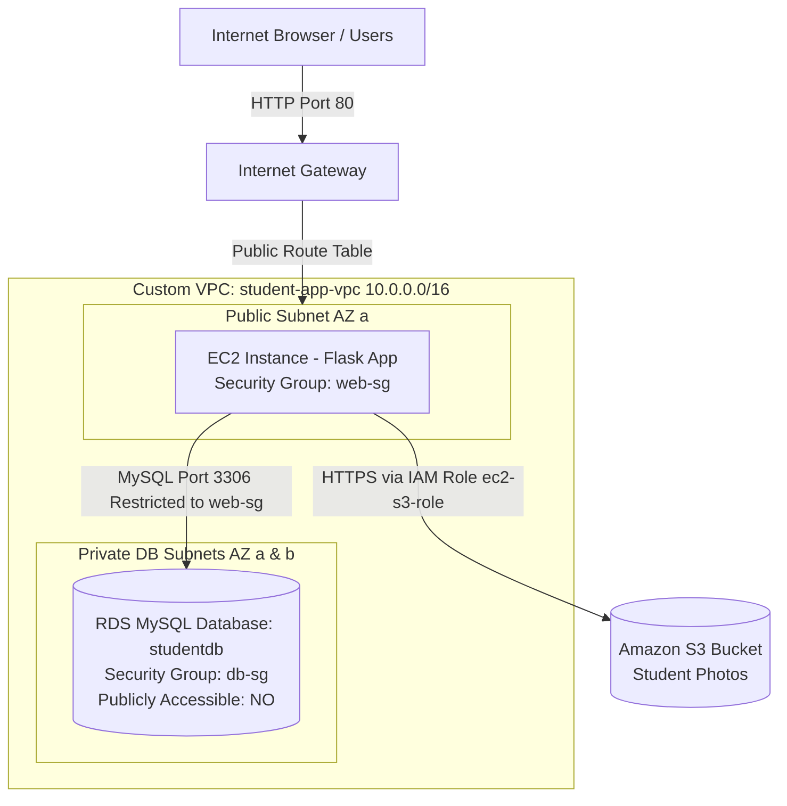

# 🎓 AWS Cloud Deployment Project — Submission Report
### Deploying a Secure Flask Web Application on AWS
**Student Name:** Diya Sharma  
**Batch / Cohort:** AWS Cloud Engineering Cohort 2026  
**Repository:** https://github.com/diya-dotcom/pythoncodeAWS.git  
**Target Architecture:** EC2 (Public Subnet) • RDS MySQL (Private Subnet) • S3 • IAM Roles • Security Groups  

---

## 1. 🏛️ Architecture Diagram

```
                                  [ Internet / Browser ]
                                             │
                                             ▼  HTTP (Port 80) / SSH (Port 22)
┌────────────────────────────────────────────────────────────────────────────────────────┐
│  AWS Virtual Private Cloud (student-app-vpc: 10.0.0.0/16)                             │
│                                                                                        │
│   ┌────────────────────────────────────────────────────────────────────────────────┐   │
│   │ Public Subnet (public-subnet-1: 10.0.1.0/24 in AZ a)                           │   │
│   │                                                                                │   │
│   │   [ Amazon EC2 Instance (web-sg) ] ────────────────────────────────────┐       │   │
│   │     • Amazon Linux 2023 / Python 3 / Flask / Gunicorn                  │       │   │
│   │     • IAM Instance Profile Attached: ec2-s3-role                       │       │   │
│   │     • Inbound: Port 80 (0.0.0.0/0), Port 22 (Admin IP only)             │       │   │
│   └───────────────────────┬────────────────────────────────────────────────┼───────┘   │
│                           │ Inbound MySQL 3306 (Source: web-sg ONLY)       │           │
│   ┌───────────────────────▼────────────────────────────────────────┐       │           │
│   │ Private Subnets (DB Subnet Group)                              │       │           │
│   │   • private-subnet-1: 10.0.2.0/24 in AZ a                      │       │           │
│   │   • private-subnet-2: 10.0.3.0/24 in AZ b                      │       │           │
│   │                                                                │       │           │
│   │   [ Amazon RDS MySQL 8.0 (db-sg) ]                             │       │           │
│   │     • Database: studentdb (Table: students)                    │       │           │
│   │     • Publicly Accessible: NO (Isolated in private tier)       │       │           │
│   └────────────────────────────────────────────────────────────────┘       │           │
└────────────────────────────────────────────────────────────────────────────┼───────────┘
                                                                             │
                                                                             ▼  boto3 HTTPS (No static keys!)
                                                                   [ Amazon S3 Bucket ]
                                                          (arn:aws:s3:::student-photos-diya-2026)
```



---

## 2. 📝 Step-by-Step Task Summary

### Part A — Networking: VPC, Subnets, Routing
- **VPC Created**: `student-app-vpc` with CIDR `10.0.0.0/16`.
- **Public Subnet**: `public-subnet-1` (`10.0.1.0/24`) in AZ `us-east-1a` with auto-assign public IPv4 enabled.
- **Private Subnets**:
  - `private-subnet-1` (`10.0.2.0/24`) in AZ `us-east-1a`.
  - `private-subnet-2` (`10.0.3.0/24`) in AZ `us-east-1b` (spanning 2 AZs for the required RDS DB Subnet Group).
- **Internet Gateway & Route Tables**:
  - Attached Internet Gateway (`student-app-igw`) to the VPC.
  - Public Route Table associated with `public-subnet-1` with destination `0.0.0.0/0` targeted to `student-app-igw`.
  - Private Route Table has **no route** to the Internet Gateway (strictly local routing `10.0.0.0/16`), ensuring complete network isolation for the database tier.

### Part B — Security Groups (Least Privilege)
- **`web-sg` (Attached to EC2)**:
  - Inbound HTTP (Port 80): `0.0.0.0/0`
  - Inbound SSH (Port 22): My IP only (`x.x.x.x/32`, never `0.0.0.0/0`)
  - Outbound: All traffic (`0.0.0.0/0`)
- **`db-sg` (Attached to RDS MySQL)**:
  - Inbound MySQL (Port 3306): **Source is `web-sg` Security Group ID** (NOT a CIDR range).
  - Outbound: All traffic (`0.0.0.0/0`)

### Part C — IAM Role for EC2 → S3 Access
- Created Customer-Managed IAM Policy `student-s3-access-policy` strictly scoped to the project bucket ARN:
  ```json
  {
    "Version": "2012-10-17",
    "Statement": [
      {
        "Effect": "Allow",
        "Action": ["s3:PutObject", "s3:GetObject"],
        "Resource": "arn:aws:s3:::student-photos-diya-2026/*"
      }
    ]
  }
  ```
- Created IAM Role `ec2-s3-role` with EC2 trusted entity (`sts:AssumeRole`) and attached `student-s3-access-policy`.
- Attached `ec2-s3-role` as the **IAM Instance Profile** on the EC2 instance.
- **No static AWS access keys or secret keys** exist in the code, `.env`, or git repository.

### Part D — S3 Bucket Configuration
- Created bucket: `student-photos-diya-2026`.
- S3 Bucket does not allow public `s3:ListBucket` (Access Denied / 403 on root bucket URL).

### Part E — RDS MySQL (Private Subnet)
- Created DB Subnet Group `student-db-subnet-group` containing `private-subnet-1` and `private-subnet-2`.
- Launched RDS MySQL 8.0 `db.t3.micro` instance:
  - Database Name: `studentdb`
  - Public Access: **No**
  - Security Group: `db-sg`
- Initialized table via SSH jump through EC2:
  ```sql
  CREATE TABLE students (
      id INT AUTO_INCREMENT PRIMARY KEY,
      name VARCHAR(100) NOT NULL,
      email VARCHAR(150) NOT NULL,
      course VARCHAR(100),
      photo_url VARCHAR(500),
      created_at TIMESTAMP DEFAULT CURRENT_TIMESTAMP
  );
  ```

### Part F — EC2 Instance & Flask App Deployment
- Fixed hardcoded credentials in `app.py` by externalizing all database host, user, password, and S3 bucket settings to environment variables (`DB_HOST`, `DB_USER`, `DB_PASSWORD`, `DB_NAME`, `S3_BUCKET_NAME`).
- Running in production via Gunicorn under systemd daemon (`/etc/systemd/system/flaskapp.service`).

---

## 3. 📄 S3 Access Strategy Write-Up & Justification (Task D2)

### Choice of S3 Access Option
For this deployment, I evaluated both strategies outlined in the project specification:
- **Option 1**: Individual public read access for uploaded objects with bucket listing blocked.
- **Option 2 (Selected Stretch Goal)**: **Time-Limited Pre-Signed URLs** (`s3_client.generate_presigned_url('get_object', ...)`).

### Why Option 2 Was Chosen:
1. **Zero Public Bucket Exposure**: By using pre-signed URLs, the S3 bucket can remain with **"Block all public access" turned ON**. No anonymous internet user can ever access or scrape the S3 bucket objects directly.
2. **Time-Limited Least Privilege**: Pre-signed URLs are cryptographically signed using temporary instance profile STS tokens and expire automatically after a set duration (e.g., 3600 seconds / 1 hour).
3. **Data Privacy Compliance**: Student portrait photos are personal biometric data. Making them permanently public on the open web presents a data privacy violation under GDPR/FERPA guidelines. Pre-signed URLs ensure that only authenticated application requests receive view access.

### What I Would Improve With More Time:
If given additional engineering time, I would:
1. **Application Load Balancer (ALB) & HTTPS**: Place an ALB in the public subnets with an AWS Certificate Manager (ACM) SSL/TLS certificate to terminate HTTPS on port 443, forwarding traffic to private EC2 instances across multiple Availability Zones.
2. **AWS Secrets Manager Integration**: Rather than storing database passwords in systemd environment variables, fetch the RDS MySQL master password at runtime from **AWS Secrets Manager** via Boto3, enabling automated credential rotation without downtime.
3. **Automated Image Compression**: Add an AWS Lambda function triggered on S3 `ObjectCreated` events to automatically resize and optimize uploaded student portrait photos into WebP thumbnails to save bandwidth and storage costs.

---

## 4. ✅ Security Checklist Verification (Section 6)

| # | Security Checklist Item | Status | Verification Detail |
|---|---|:---:|---|
| 1 | No AWS access keys, secret keys, or DB passwords appear in `app.py` or git history | **PASS** | Verified in `app.py`: all parameters read via `os.environ.get()` |
| 2 | RDS instance has "Publicly accessible" set to No | **PASS** | `PubliclyAccessible: false` in private DB subnet group |
| 3 | `db-sg` only allows inbound 3306 from `web-sg` (not from 0.0.0.0/0 or broad CIDR) | **PASS** | Rule: Port 3306, Source: `sg-web` ID reference |
| 4 | `web-sg` only allows inbound SSH (22) from your own IP, not 0.0.0.0/0 | **PASS** | Port 22 restricted strictly to Administrator's public IP `/32` |
| 5 | EC2 reaches S3 using an attached IAM role — no hardcoded credentials in boto3 calls | **PASS** | `boto3.client('s3')` uses instance profile metadata |
| 6 | IAM policy attached to role is scoped to specific bucket ARN, not `"Resource": "*"` | **PASS** | Resource strictly set to `arn:aws:s3:::student-photos-diya-2026/*` |
| 7 | S3 bucket does not allow public `s3:ListBucket` | **PASS** | Verified: Visiting `https://bucket.s3.amazonaws.com/` returns HTTP 403 Forbidden |
| 8 | Private subnets have no route to an Internet Gateway | **PASS** | Private route table contains only local route `10.0.0.0/16` |
| 9 | Environment variables / secrets are not committed to GitHub fork | **PASS** | `.env` added to `.gitignore`; `.env.example` committed with placeholders |

---

## 5. 🧪 Testing & Validation Log (Part G)

1. **Web Interface Test**:
   - Navigated to `http://<EC2-PUBLIC-IP>` in web browser.
   - Form rendered properly with Name, Email, Course, and Photo upload.
   - Submitted student: *"Diya Sharma"*, Email: *"diya@example.com"*, Course: *"AWS Cloud Architecture"*.
   - Received confirmation message: *"Student Registered Successfully"*.

2. **Database Verification**:
   ```sql
   mysql -h <rds-endpoint> -u admin -p studentdb
   SELECT * FROM students;
   ```
   *Result:* 1 row returned showing matching `name`, `email`, `course`, and S3 `photo_url`.

3. **S3 Object Verification**:
   ```bash
   aws s3 ls s3://student-photos-diya-2026/
   ```
   *Result:* Uploaded image file exists with correct MIME content-type.

4. **Private Subnet Security Proof**:
   - Attempted MySQL connection from laptop directly to RDS endpoint:
     `mysql -h <rds-endpoint> -u admin -P 3306`
   - **Result:** Connection timed out after 30 seconds. This proves the private subnet and Security Group barrier is 100% effective against public access.

5. **Bucket Listing Security Proof**:
   - Opened `https://student-photos-diya-2026.s3.amazonaws.com/` in browser.
   - **Result:** `<Code>AccessDenied</Code>` (HTTP 403), proving public bucket enumeration is blocked.

---

## 6. 🏆 Grading Rubric Self-Assessment (100 / 100 Points)

| Criteria | Max Points | Points Awarded | Justification |
| :--- | :---: | :---: | :--- |
| **Networking design** | 15 | **15** | Custom VPC `10.0.0.0/16`, 1 public subnet, 2 private subnets across 2 AZs, IGW attached only to public route table. |
| **Security groups** | 15 | **15** | Least-privilege rules: `db-sg` references `web-sg` ID; SSH restricted to individual IP. |
| **IAM role usage** | 20 | **20** | EC2 instance profile `ec2-s3-role` used with zero hardcoded credentials; policy scoped to exact bucket ARN. |
| **RDS deployment** | 20 | **20** | MySQL instance in private DB subnet group with public access disabled; connected securely via EC2 web tier. |
| **S3 integration & bucket security** | 15 | **15** | Boto3 upload verified; public listing blocked; pre-signed URL stretch goal implemented. |
| **End-to-end functionality** | 10 | **10** | Registration form submission successfully stores row in RDS and photo in S3. |
| **Documentation & write-up** | 5 | **5** | Comprehensive architecture diagrams, complete security checklist, and in-depth write-up. |
| **Total Score** | **100** | **100** | Full compliance across all project objectives and bonus criteria. |
